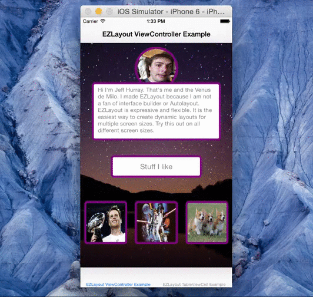
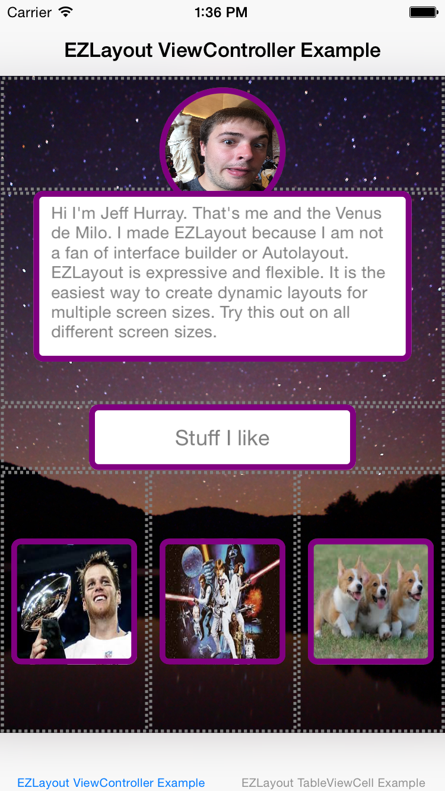
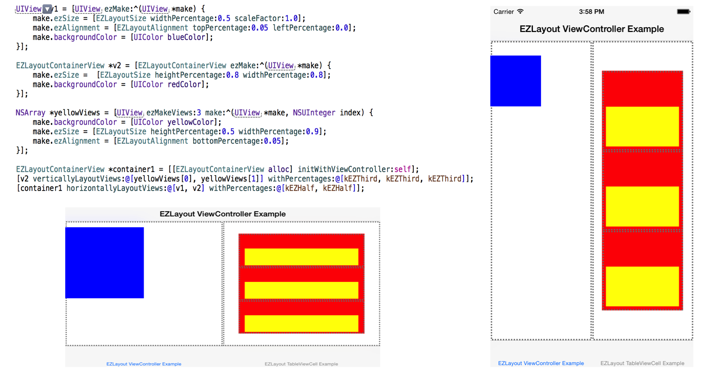

# EZLayout
A new take on iOS layouts using percentages. Imagine UIStackViews on crack. Goodbye autolayout.

[Full API Cheatsheet](#api)

</img>
</img>

</img>

###Usage

Either clone the repo and manually add the Files in [EZLayout](./EZLayout) or add the following to your Podfile

```
pod 'EZLayout', '~> 0.1.0'
```
Then just import the following header.

```objective-c
#import "EZLayout.h"
```
###Why I made EZLayout
Right now Autolayout is the only thing out there. Pretty much everyone seems to have adopted it and it monopolizes on the layout game. There are countless libraries built around autolayout to try and simplify it ([Masonry](https://github.com/SnapKit/Masonry), [PureLayout](https://github.com/smileyborg/PureLayout), etc..) but at the end of the day it still just doesn't do it for me.

#####Cons of AutoLayout:
   
* Its slower than frame based layout  
* Tough to make a dynamic layout (animations, resizing etc...)  
* Constraints that work on one device may crash on another 

I wanted to make a frame based layout library that can easily deal with variable screen sizes and orientation changes, while keeping an simple and expressive syntax. 

##Layout Classes

###EZLayoutAlignment

EZLayoutAlignment lets you express how a view is aligned in its superview. It defaults to centered.

```objective-c
// The view will be in the top right of the superview
myView.ezAlignment = [EZLayoutAlignment topRight];
```

[Full list of EZLayoutAlignment options](#api-alignment)

###EZLayoutSize

EZLayoutSize lets you express the size of a view. It can either be percentages relative to the superviews size or a fixed size. 

```objective-c
// The view will be 50% of the superviews height and 85% of the superviews width
myView.ezSize = [EZLayoutSize heightPercentage:0.5 widthPercentage:0.85];

// OR

// The view will be 85% of the superviews width and the height will scale to 75% of the width (75% of 85% of the superviews width)
myView.ezSize = [EZLayoutSize widthPercentage:0.85 scaleFactor:0.75];
```

[Full list of EZLayoutAlignment options](#api-alignment)

###EZLayoutContainerView
EZLayoutContainerView is a UIViewSubclass that aids in the layout of views. All of its subviews are layed out with respects to their size and alignment values.

[Full list of EZLayoutContainerView methods](#api-container)

#####Horizontal + Vertical Stack Layouts
A base container view should be attached to a view controller or tableview cell. 

```objective-c
EZLayoutContainerView *base = [EZLayoutContainerView containerWithViewController:self];
```

#####Horizontal + Vertical Stack Layouts
Containers can layout views horizontally or vertically with percentages.

```objective-c
[container verticallyLayoutViews:@[v1, v2, coolStuffContainer] withPercentages:@[@0.5, @0.5]];
```
#####Blank Spaces
Containers can layout views with blank spaces in between by using **kEZBlankSpace**.

```objective-c
[container verticallyLayoutViews:@[v1, kEZBlankSpace, v2] withPercentages:@[@0.3, @0.4 @0.3]];
```
#####Fixed Sizes
Containers can layout views with fixed widths as well. You can mix in flexible widths in these methods.

```objective-c
// ezFlexDefault is a macro value that says that view 2 will have a flexible height.
[container verticallyLayoutViews:@[view1, view2, view3] withFixedHeights:@[@20, ezFlexDefault, @22]];

// You can give ratios of flexibilities as well. Here both view2 and view3 are of flexible height, but view3 is twice the height of view2.
[container verticallyLayoutViews:@[view1, view2, view3] withFixedHeights:@[@20, ezFlexRatio(1.0), ezFlexRatio(2.0)]];
```
#####Landscape Layouts
Containers can have different layout schemes for portrait and landscape mode. If you dont set landscape layouts then the default landscape layout will be the same as the portrait layout.

```objective-c
[container horizontallyLayoutLandscapeViews:@[descriptionContainer, coolStuffContainer] withLandscapePercentages:@[@0.5, @0.5]];
```
#####Adding Subviews
Containers can add other container views as subviews as well.

```objective-c
base = [EZLayoutContainerView container];
subview = [EZLayoutContainerView ezMake:^(UIView *make) {
   make.ezSize = [EZLayoutSize heightPercentage:0.8 widthPercentage:0.8];
}];
// subview will be layed out with the appropriate size and alignment in the base container.
[subview attachToContainerView:base];
```
#####Subview Heirarchy
Containers will organize their subviews by tags. Larger tags will be above smaller or nil tags.

```objective-c
EZLayoutContainerView *c1 = [EZLayoutContainerView container];
EZLayoutContainerView *c2 = [EZLayoutContainerView container];
EZLayoutContainerView *base = [EZLayoutContainerView container];

// c2 will be above c1
c1.tag = 5;
c2.tag = 10;
[c1 attachToContainerView:base];
[c2 attachToContainerView:base];
```
You can set the **orderSubviewsByTag** property to ```NO``` if you dont want this to be the case. 

##UIView+EZLayout

###Initializers
The **UIView+EZLayout** category provides initializers for EZLayout.

```objective-c
// Standard initializer
UIView *view1 = [UIView ezMakeBasic];

// A block initializer that will return a view configured in the block
UIButton *button = [UIButton ezMake:^(UIView *make) {
   make.ezSize = [EZLayoutSize heightPercentage:0.8 widthPercentage:0.85];
   make.ezAlignment = [EZLayoutAlignment top];
}];

// A block initializer that will return an array of views configured in the block.
NSArray *imageViews = [UIImageView ezMakeViews:3 make:^(UIView *make, NSUInteger index) {
   UIImageView *imageView = (UIImageView *)make;
   imageView.image = [UIImage imageNamed:@"default"];
   imageView.ezSize = [EZLayoutSize widthPercentage:0.85 scaleFactor:1.0];
}];

```
###FrameWasSetBlock

The **frameWasSetBlock** property is a block that will be called after the views frame is set. This is an ideal place to set corner radius amd other properties that are dependant on the frame of the view.

```objective-c
view.frameWasSetBlock = ezFrameWasSetBlock() {
            self.view.layer.cornerRadius = self.view.ezHeight/2.0;
        };
```

###Helpers

The following properties are shortcuts to the values of the views frame. These properties are gettable and settable.

```objective-c
#pragma mark - EZLayout Helpers
@property (nonatomic) CGFloat ezX;
@property (nonatomic) CGFloat ezY;
@property (nonatomic) CGFloat ezHeight;
@property (nonatomic) CGFloat ezWidth;
```

##Debug Mode
To see how views are layed out you can set the kEZDebugMode flag to YES. This will add Dotted lines around all views layed out in EZLayoutContainerViews. It is extremely useful for debugging. You can find this flag defined in [EZLayoutConstants.h](./EZLayout/EZLayoutConstants.h) .

```objective-c
/* DEBUG */

// YES: Dotted Lines will appear around all views to show their containment.
// NO: No dotted lines around views
#define kEZDebugMode YES
```

##Precalculated Values

In [EZLayoutConstants.h](./EZLayout/EZLayoutConstants.h) there are a ton of precalculated values representing different percentages. This should make layout calculations a breeze. 

```objective-c
[container verticallyLayoutViews:@[view1, view2, view3] 
	     withLandscapePercentages:@[kEZSeventh, kEZTwoSevenths, kEZFourSevenths]];
```

##Shorthand
Some of these methods are a little bulky. If you are an EZLayout Expert and want shorter class names and methods, import the following header.

```objective-c
#import "EZLayout+Shorthand.h"
```

```objective-c
EZLayoutContainerView -> EZContainerView
EZLayoutSize -> EZSize
EZLayoutAlignment - > EZAlignment

view.ezAlignment = [EZLayoutAlignment topPercentage:0.1 rightFixed:40];
// becomes
view.ezAlignment = [EZAlignment tP:0.1 rF:40];

// There are many more shorthand methods for the classes above. Try it out!
```

##<a name="api"></a>API Cheatsheet

###<a name="api-alignment"></a>EZLayoutAlignment
```objective-c
#pragma mark - Absolute

+ (instancetype) center; // default val
+ (instancetype) top;
+ (instancetype) bottom;
+ (instancetype) left;
+ (instancetype) right;
+ (instancetype) topLeft;
+ (instancetype) topRight;
+ (instancetype) bottomLeft;
+ (instancetype) bottomRight;

#pragma mark - Percentage

+ (instancetype) topPercentage:(CGFloat)topMarginPercentage;
+ (instancetype) bottomPercentage:(CGFloat)bottomMarginPercentage;
+ (instancetype) leftPercentage:(CGFloat)leftMarginPercentage;
+ (instancetype) rightPercentage:(CGFloat)rightMarginPercentage;
+ (instancetype) topPercentage:(CGFloat)topMarginPercentage leftPercentage:(CGFloat)leftMarginPercentage;
+ (instancetype) topPercentage:(CGFloat)topMarginPercentage rightPercentage:(CGFloat)rightMarginPercentage;
+ (instancetype) bottomPercentage:(CGFloat)bottomMarginPercentage leftPercentage:(CGFloat)leftMarginPercentage;
+ (instancetype) bottomPercentage:(CGFloat)bottomMarginPercentage rightPercentage:(CGFloat)rightMarginPercentage;

@property (nonatomic) CGFloat topMarginPercentage;
@property (nonatomic) CGFloat bottomMarginPercentage;
@property (nonatomic) CGFloat leftMarginPercentage;
@property (nonatomic) CGFloat rightMarginPercentage;

#pragma mark - Fixed

+ (instancetype) topFixed:(CGFloat)topMarginFixed;
+ (instancetype) bottomFixed:(CGFloat)bottomMarginFixed;
+ (instancetype) leftFixed:(CGFloat)leftMarginFixed;
+ (instancetype) rightFixed:(CGFloat)rightMarginFixed;
+ (instancetype) topFixed:(CGFloat)topMarginFixed leftFixed:(CGFloat)leftMarginFixed;
+ (instancetype) topFixed:(CGFloat)topMarginFixed rightFixed:(CGFloat)rightMarginFixed;
+ (instancetype) bottomFixed:(CGFloat)bottomMarginFixed leftFixed:(CGFloat)leftMarginFixed;
+ (instancetype) bottomFixed:(CGFloat)bottomMarginFixed rightFixed:(CGFloat)rightMarginFixed;

@property (nonatomic) CGFloat topMarginFixed;
@property (nonatomic) CGFloat bottomMarginFixed;
@property (nonatomic) CGFloat leftMarginFixed;
@property (nonatomic) CGFloat rightMarginFixed;

#pragma mark - Percentage + Fixed

+ (instancetype) topPercentage:(CGFloat)topMarginPercentage leftFixed:(CGFloat)leftMarginFixed;
+ (instancetype) topFixed:(CGFloat)topMarginFixed leftPercentage:(CGFloat)leftMarginPercentage;

+ (instancetype) topPercentage:(CGFloat)topMarginPercentage rightFixed:(CGFloat)rightMarginFixed;
+ (instancetype) topFixed:(CGFloat)topMarginFixed rightPercentage:(CGFloat)rightMarginPercentage;

+ (instancetype) bottomPercentage:(CGFloat)bottomMarginPercentage leftFixed:(CGFloat)leftMarginFixed;
+ (instancetype) bottomFixed:(CGFloat)bottomMarginFixed leftPercentage:(CGFloat)leftMarginPercentage;

+ (instancetype) bottomPercentage:(CGFloat)bottomMarginPercentage rightFixed:(CGFloat)rightMarginFixed;
+ (instancetype) bottomFixed:(CGFloat)bottomMarginFixed rightPercentage:(CGFloat)rightMarginPercentage;

```

###<a name="api-size"></a>EZLayoutSize
```objective-c
/***
 
 EZLayoutSizeTypeHeightAndWidth: heightPercentage and widthPercentage set: scale factor plays no role.
 
 EZLayoutSizeTypeHeightAndScale: heightPercentage and scaleFactor set: widthPercentage = MIN(1.0, heightPercentage*scaleFactor)
 
 EZLayoutSizeTypeWidthAndScale: widthPercentage and scaleFactor set: heightPercentage = MIN(1.0, widthPercentage*scaleFactor)
 
 EZLayoutSizeTypeFixed: fixed height and width in frame pixels. Does not need to be between 1.0 and 0.0
 
***/

// Dynamic
+ (instancetype) heightPercentage:(CGFloat)heightPercentage widthPercentage:(CGFloat)widthPercentage;
+ (instancetype) heightPercentage:(CGFloat)heightPercentage scaleFactor:(CGFloat)scaleFactor;
+ (instancetype) widthPercentage:(CGFloat)widthPercentage scaleFactor:(CGFloat)scaleFactor;

// Fixed
+ (instancetype)  heightFixed:(CGFloat) heightFixed  widthFixed:(CGFloat) widthFixed;
// Fixed + Dynamic
+ (instancetype)  heightFixed:(CGFloat) heightFixed widthPercentage:(CGFloat)widthPercentage;
+ (instancetype)  widthFixed:(CGFloat)widthFixed heightPercentage:(CGFloat)heightPercentage;

// Dynamic
@property (nonatomic) CGFloat heightPercentage;
@property (nonatomic) CGFloat widthPercentage;
@property (nonatomic) CGFloat scaleFactor;
// Fixed
@property (nonatomic) CGFloat fixedWidth;
@property (nonatomic) CGFloat fixedHeight;
```

###<a name="api-container"></a>EZLayoutContainerView

```objective-c
#pragma mark - Class Initializers
// Basic init
+ (instancetype) container;
// Initializers for portrait mode
+ (instancetype) containerFilledWithView:(UIView *)view;
+ (instancetype) containerWithHorizontalViews:(NSArray *)views percentages:(NSArray *)percentages;
+ (instancetype) containerWithVerticalViews:(NSArray *)views percentages:(NSArray *)percentages;
+ (instancetype) containerWithHorizontalViews:(NSArray *)views fixedWidths:(NSArray *)fixedWidths;
+ (instancetype) containerWithVerticalViews:(NSArray *)views fixedHeights:(NSArray *)fixedHeights;
// Initializer for the first container view
// starts EZLayout
// calls attachToViewController:
+ (instancetype) containerWithViewController:(UIViewController *)viewController;
// Initializer for the first container view
// starts EZLayout
// calls attachToTableViewCell:
+ (instancetype) containerWithTableViewCell:(UITableViewCell *)cell;
// Initializer for the first container view
// starts EZLayout
// calls attachToContainerView:
+ (instancetype) containerWithContainerView:(EZLayoutContainerView *)containerView;

#pragma mark - Instance Initializers
// Initializers for portrait mode
- (instancetype) initWithViewToFill:(UIView *)view;
- (instancetype) initWithHorizontalViews:(NSArray *)views percentages:(NSArray *)percentages;
- (instancetype) initWithVerticalViews:(NSArray *)views percentages:(NSArray *)percentages;
- (instancetype) initWithHorizontalViews:(NSArray *)views fixedWidths:(NSArray *)fixedWidths;
- (instancetype) initWithVerticalViews:(NSArray *)views fixedHeights:(NSArray *)fixedHeights;
// Initializer for the first container view
// starts EZLayout
// calls attachToViewController:
- (instancetype) initWithViewController:(UIViewController *)viewController;
// Initializer for the first container view
// starts EZLayout
// calls attachToTableViewCell:
- (instancetype) initWithTableViewCell:(UITableViewCell *)cell;
// Initializer for the first container view
// starts EZLayout
// calls attachToContainerView:
- (instancetype) initWithContainerView:(EZLayoutContainerView *)containerView;

// Used to start EZLayout
- (void) attachToViewController:(UIViewController *)viewController;
- (void) attachToTableViewCell:(UITableViewCell *)cell;
- (void) attachToContainerView:(EZLayoutContainerView *)containerView;

#pragma mark - Portrait Orientation
// Must be set
@property (nonatomic, strong, readonly) NSArray *views;
@property (nonatomic, strong, readonly) NSArray *percentages;

/* Fill */
- (void) fillWithView:(UIView *)view;

/* Dynamic */
// lays out views left to right
- (void) horizontallyLayoutViews:(NSArray *)views withPercentages:(NSArray *)percentages;
// Lays out views top to bottom
- (void) verticallyLayoutViews:(NSArray *)views withPercentages:(NSArray *)percentages;

/* Fixed + Dynamic */
// lays out views left to right
- (void) horizontallyLayoutViews:(NSArray *)views withFixedWidths:(NSArray *)widths;
// Lays out views top to bottom
- (void) verticallyLayoutViews:(NSArray *)views withFixedHeights:(NSArray *)heights;

#pragma mark - Landscape Orientation
// Can be nil
// If nil and portrait supported, will translate to portrait layout
@property (nonatomic, strong, readonly) NSArray *landscapeViews;
@property (nonatomic, strong, readonly) NSArray *landscapePercentages;

/* Fill */
- (void) fillWithLandscapeView:(UIView *)view;

/* Dynamic */
// lays out views left to right
- (void) horizontallyLayoutLandscapeViews:(NSArray *)landscapeViews withLandscapePercentages:(NSArray *)landscapePercentages;
// Lays out views top to bottom
- (void) verticallyLayoutLandscapeViews:(NSArray *)landscapeViews withLandscapePercentages:(NSArray *)landscapePercentages;

/* Fixed + Dynamic */
// lays out views left to right
- (void) horizontallyLayoutLandscapeViews:(NSArray *)landscapeViews withFixedLandscapeWidths:(NSArray *)landscapeWidths;
// Lays out views top to bottom
- (void) verticallyLayoutLandscapeViews:(NSArray *)landscapeViews withFixedLandscapeHeights:(NSArray *)landscapeHeights;

#pragma mark - Force Layout
// These should be called if views and/or percentages are  changed.
// Animated is wrapped in animation block
- (void) ezLayoutSubviews;
- (void) ezLayoutSubviewsAnimated;

#pragma mark - View Ordering 

@property (nonatomic) BOOL orderSubviewsByTag; // Defaults to 'true'
```

##To Do
If you think this is missing anything please let me know! The following is what I plan on working on in no particular order.

* Code Snippets

##Contact Info && Contributing

Feel free to email me at [jhurray33@gmail.com](mailto:jhurray33@gmail.com?subject=JHChainableAnimations). I'd love to hear your thoughts on this, or see examples where this has been used.

[MIT License](./LICENSE)